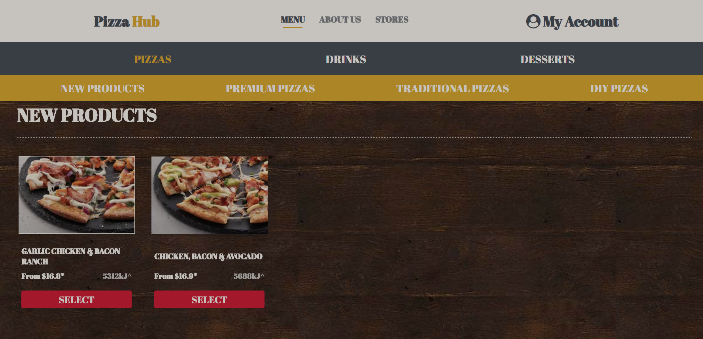
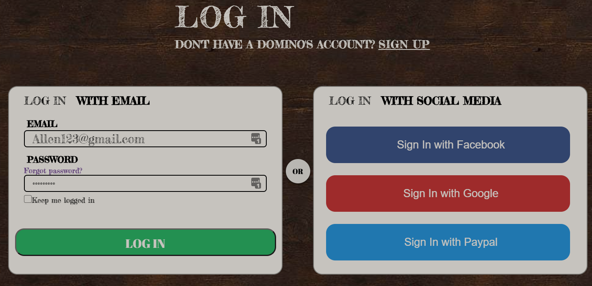
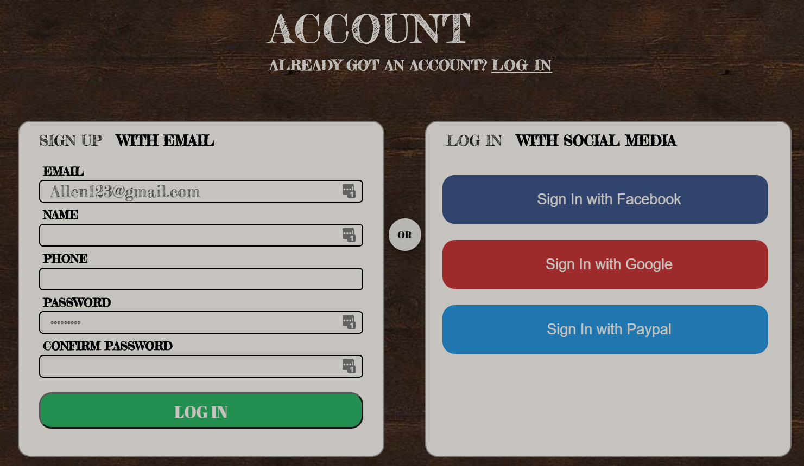
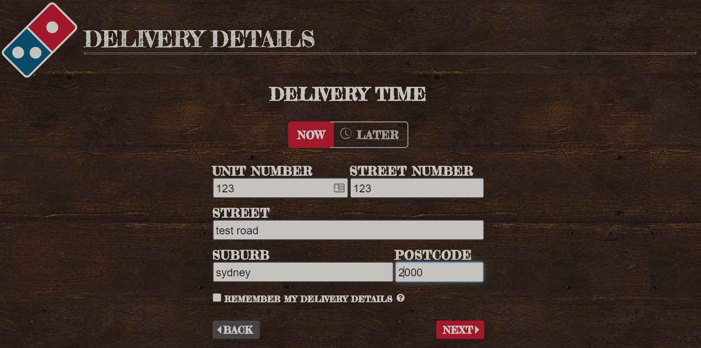
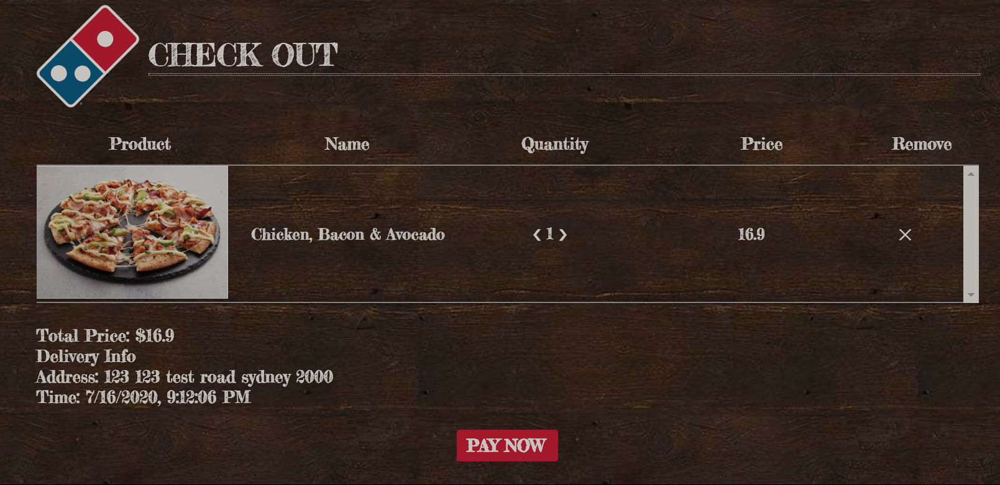

<p align="center">
 </a>
</p>

<h3 align="center">Online Pizza Order Website</h3>

<div align="center">

[]()
[](/LICENSE)

</div>

---

<p align="center"> 🍕 A fully-functional online pizza ordering website built with <b>React.js</b>, <b>Koa.js</b> and <b>MongoDB</b>, containing customer page for customers and admin page for administrators.
</p>

## 📝 Table of Contents

- [About](#about)
- [Demo](#demo)
- [How it works](#working)
- [Getting Started](#getStart)
- [Authors](#authors)

## 🧐 About <a id = "about"></a>

An online pizza order website (like Domino Pizza) with the functionalities allowing customers to register, login, logout, select items and checkout and administrators to review orders.

## 🎥 Demo <a id = "demo"></a>

### Demo Website:
- frontend: https://idea-tree-pizza-frontend.vercel.app/
- backend: https://idea-pizza-backend.herokuapp.com/
- Demo Username: Allen123@gmail.com
- Demo Passwords: Allen123@

### 📀 Select a Pizza



### 💿 Login or Register 




### 💽 Fill up Address



### 💿 Checkout orders




## 💭 How it works <a id = "working"></a>

- Built readable, maintainable, reusable front-end components via `React.js`, `Redux` and `React-Hooks`.
- Used `React-Router` to ensure the Single-Page Application.
- Used `Redux` and `React-Redux`as the state management tool to maintain global persistent states and avoid long props chain.
- Built a `Koa.js` based backend to offer RESTful APIs functionalities and interact with the MongoDB for storing data of users and orders.
- Used `Swagger` to build API documentation and debugging page
- Implemented the JWT token-based Authentication to verify the user identity.

## 🏁 Getting Started <a id = "getStart"></a>
These instructions will guide you to set up the project and run on your local machine for development and testing purposes.

### 🔧 Prerequisites
What things you need to install the software and how to install them.
```
Node
React
MongoDB
```

### ⚙️  Setup [MongoDB](https://www.mongodb.com/)

Change the secret key of your own MongoDB
At **/server/config/config.env**

```
MONGO_URI={YOUR_MONGODB_CONNECT_KEY}
```

### ⛏️ Installing

At root folder
```
npm install
npm start
```
[Backend repo](https://bitbucket.org/Michael_Guo11/idea_tree_pizza_backend/src/master/)

## ✍️ Authors <a id = "authors"></a>

- [@Allen Xiao](https://github.com/pengfei123xiao)